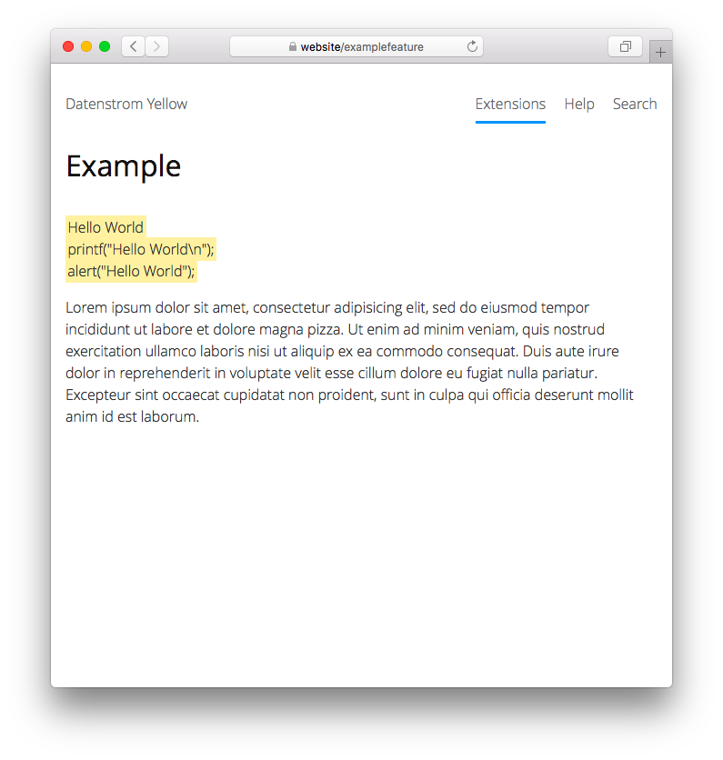

# Example 0.9.2

Example feature for Datenstrom Yellow. Developed by Anna Svensson.

## How to install an extension

[Download ZIP file](https://github.com/annaesvensson/yellow-example/archive/refs/heads/main.zip) and copy it into your `system/extensions` folder. [Learn more about extensions](https://github.com/annaesvensson/yellow-update).

## How to format text with a custom shortcut

Create a `[example]` shortcut with an optional text. 

## Examples

Content file with custom shortcut:

    ---
    Title: Example page
    ---
    This is an example page with a custom shortcut.

    [example Hello World]
    [example printf("Hello World\n");]
    [example alert("Hello World");]  

    Lorem ipsum dolor sit amet, consectetur adipisicing elit, sed do eiusmod 
    tempor incididunt ut labore et dolore magna pizza. Ut enim ad minim veniam, 
    quis nostrud exercitation ullamco laboris nisi ut aliquip ex ea commodo.

Formatting text with a custom shortcut:

    [example We <3 people who code.]
    [example This is an example text.]
    [example This is an especially long example text.]  

## Acknowledgements

This extension includes feedback by Giovanni Salmeri and Steffen Schultz. Thank you for your help.

Do you have questions? [Get help](https://datenstrom.se/yellow/help/).
